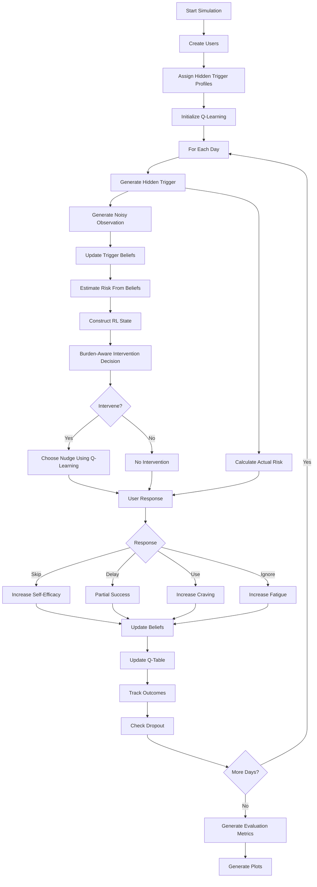

# Designing-Human-Centered-AI
Algorithmic Support

# Things to fix: 
* Maybe full POMDP environment
* Decide on final plots

# Psychology-Informed Reinforcement Learning for Adaptive Snus Reduction

## Overview

This project implements a psychology-informed adaptive recommender system designed to support snus reduction through personalized behavioral interventions.

The system is modeled as a partially observable reinforcement learning problem where the true causes of cravings are hidden from the algorithm. Instead of directly observing a user's trigger, the system receives noisy contextual observations and must infer likely triggers over time.

The goal is to investigate how reinforcement learning, behavioral psychology, and hidden-state inference can be combined to support behavior change while balancing intervention effectiveness against user fatigue and dropout.

---

## Research Motivation

Digital health interventions often face two key challenges:

1. Determining the right moment to intervene.
2. Determining the right intervention for a particular user.

In practice, users have different addiction levels, motivations, triggers, and responses to interventions. Furthermore, many triggers are not directly observable.

This project explores whether an adaptive reinforcement learning system can learn personalized intervention strategies under uncertainty.

---

## Project Structure

```text
project/
│
├── main.py
├── config.py
├── user.py
├── simulation.py
├── evaluation.py
├── plots.py
├── utils.py
└── README.md
```

### `config.py`

Contains:

- User group definitions
- Trigger definitions
- Observation model
- Q-learning parameters
- Reward function
- Intervention definitions

### `user.py`

Contains:

- User psychological model
- Trigger belief updates
- Risk estimation
- Response generation
- Q-learning updates
- Dropout behavior

### `simulation.py`

Contains:

- Main simulation loop
- Intervention scheduling
- User interactions
- Event generation

### `evaluation.py`

Contains:

- Summary statistics
- Trigger inference evaluation
- Q-value inspection

### `plots.py`

Contains:

- Visualization functions

### `utils.py`

Contains:

- State discretization
- Hidden trigger generation

---

## User Groups

The simulation models four user populations:

### High Relapse Risk / High Intake

- High addiction
- High stress
- Low self-efficacy
- High baseline snus use

### High Relapse Risk / Low Intake

- Lower consumption
- High stress
- Vulnerable to relapse

### Low Relapse Risk / High Intake

- High consumption
- Stronger motivation
- Stronger self-efficacy

### Low Relapse Risk / Low Intake

- Low consumption
- Low addiction
- High motivation

Each group is initialized using different psychological profiles.

---

## Hidden Trigger Model

The simulation assumes that cravings arise from hidden contextual triggers.

Possible triggers:

- `after_meal`
- `social_setting`
- `stress`
- `studying`
- `alcohol_context`
- `morning_craving`
- `boredom`
- `sleeping`

Each user receives a hidden trigger profile that determines how likely different contexts are to cause cravings.

The true trigger is never directly observed by the recommender.

---

## Observation Model

The application does not directly observe the user's true trigger.

Instead, it receives noisy observations generated by an observation model.

Example:

```text
True trigger:
alcohol_context

Observed clue:
social_setting
```

This reflects the uncertainty faced by real-world digital health systems.

The observation model intentionally confuses psychologically related contexts, such as:

- alcohol_context ↔ social_setting
- stress ↔ studying
- sleeping ↔ morning_craving

---

## Belief State and Trigger Inference

The system maintains a probability distribution over possible triggers.

Example:

```text
stress:          0.40
after_meal:      0.25
social_setting:  0.15
boredom:         0.10
other:           0.10
```

As observations arrive, trigger beliefs are updated.

The trigger with the highest probability becomes the system's inferred trigger.

---

## Actual Risk vs Estimated Risk

The simulation separates:

### Actual Risk

The user's true relapse risk.

Actual risk depends on:

- Addiction
- Stress
- Craving
- Social pressure
- Fatigue
- Hidden trigger

Actual risk determines user behavior.

### Estimated Risk

The recommender's estimate of relapse risk.

Estimated risk depends on:

- Current trigger beliefs
- Psychological variables

The recommender only has access to estimated risk when choosing interventions.

This creates a simplified partially observable decision-making problem.

---

## Intervention Strategies

The recommender can choose between:

- `no_intervention`
- `economic_reminder`
- `snus_consumption_feedback`
- `small_reduction_goal`

### No Intervention

Included as a valid action because excessive nudging can increase fatigue and dropout.

The system can therefore learn that sometimes the best intervention is not intervening.

---

## Quitting Strategies

Each user follows one of two cessation strategies.

### Cold Turkey

The user attempts to stop immediately.

Characteristics:

- Higher early relapse risk
- Greater variability
- Potentially stronger long-term benefits

### Gradual Reduction

The user reduces consumption incrementally.

Characteristics:

- Lower early relapse risk
- More stable behavior change
- Slower long-term improvement

The simulation models these strategies differently through risk and feedback dynamics.

---

## Psychological Variables

Each user maintains:

- Motivation
- Addiction severity
- Stress
- Adherence
- Self-efficacy
- Craving
- Social pressure
- Intervention fatigue

These variables evolve over time based on user behavior and intervention outcomes.

---

## Intervention Fatigue and Dropout

Repeated interventions can increase fatigue.

Fatigue increases when:

- Nudges are ignored
- Too many interventions are delivered

Higher fatigue increases the probability of:

- Disengagement
- User dropout

This models notification fatigue commonly observed in digital health applications.

---

## Reinforcement Learning

The recommender uses tabular Q-learning.

### State Representation

A state consists of:

- User type
- Inferred trigger
- Estimated risk level
- Fatigue level
- Quitting strategy

### Available Actions

- `no_intervention`
- `economic_reminder`
- `snus_consumption_feedback`
- `small_reduction_goal`

### Reward Function

| Response | Reward |
|-----------|---------|
| Skip | +3 |
| Delay | +1.5 |
| Use | -0.5 |
| Ignore | -1 |

The Q-table learns which interventions work best for different situations.

---

## Exploration Strategy

The system uses epsilon-greedy exploration.

During training:

- Exploration starts at 30%
- Exploration gradually decreases
- The system increasingly exploits learned knowledge

During evaluation:

- Exploration is disabled
- The learned policy is used directly

---

## Economic Feedback

The simulation estimates money saved relative to baseline consumption.

Example:

```text
Baseline: 10 portions/day
Current: 5 portions/day

Savings:
5 avoided portions/day
```

This allows the model to evaluate both behavioral and economic outcomes.

---

## Evaluation Metrics

The simulation compares:

### Tracking-Only Baseline

No adaptive interventions.

### Adaptive Recommender

Q-learning-based personalized intervention system.

Metrics include:

- Snus reduction
- Dropout rate
- Intervention fatigue
- Self-efficacy
- Money saved
- Trigger inference accuracy

---

## Visualizations

### Core Evaluation Plots

- Average daily snus use: baseline vs adaptive recommender
- Adaptive effect by user type
- User retention by user type
- Event-level trigger inference heatmap
- Intervention fatigue by user type

### Additional Analysis

- Daily money saved by user type
- Cumulative money saved by user type
- Distribution of inferred triggers
- Adaptive effect by inferred trigger

---

## Running the Simulation

Install dependencies:

```bash
pip install numpy pandas matplotlib
```

Run:

```bash
python main.py
```

---

## Algorithm Flowchart



---

## Limitations

This simulation is intended as an exploratory model rather than a predictive clinical tool.

Limitations include:

- Simulated rather than real behavioral data
- Hand-designed reward structure
- Simplified psychological mechanisms
- Simplified trigger inference
- No real sensor or mobile application data
- Parameters calibrated for plausibility rather than estimated from empirical snus cessation datasets

Despite these limitations, the project demonstrates how reinforcement learning, behavioral theory, and hidden-state inference can be combined to model adaptive behavior-change support systems.