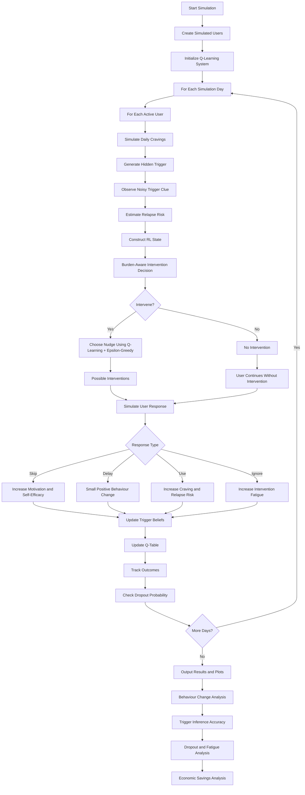

# Designing-Human-Centered-AI
Algorithmic Support

# Things to fix: 
* Model cold turkey more explicityly (more variance initially, potentially more longer term rewards)
* Gradual strategy may have more smooth and faster rewards, but converges much slower compared to cold turkey
* Incorporate observation model to incorporate noisy observations
* Create pipeline for the system, finetune plots to look more presentable


# Psychology-Informed Q-Learning Simulation for Snus Reduction

This project simulates a psychology-informed adaptive recommender system for helping users reduce snus consumption. The system is modeled as a simplified partially observable contextual reinforcement learning problem, where the application does not directly know the user's true craving trigger but tries to infer it over time.

## Project Overview

The simulation compares two systems:

1. **Tracking-only baseline**

   * The user receives no adaptive intervention.
   * Snus use may still change slightly due to self-monitoring and natural variation.

2. **Psychology-informed adaptive recommender**

   * The system uses Q-learning to decide which intervention, or nudge, to provide.
   * The recommender learns from simulated user responses over time.
   * It can also learn that sometimes the best action is to provide no intervention.

## Main Idea

The system tries to answer two questions:

* When is the right moment to intervene?
* What is the right intervention for this user in this situation?

Since real users may not always know their own triggers, the simulation treats triggers as partially hidden. The system only observes noisy clues and gradually updates its belief about what triggers each user.

## User Groups

The simulation includes four user types:

* High relapse risk / high intake
* High relapse risk / low intake
* Low relapse risk / high intake
* Low relapse risk / low intake

Each group differs in baseline snus use, motivation, addiction level, stress, adherence, and self-efficacy.

## Hidden Triggers

The model includes several possible craving triggers:

* after_meal
* social_setting
* stress
* studying
* alcohol_context
* morning_craving
* boredom
* sleeping

Each user has a hidden personal trigger profile. The system does not directly observe this profile. Instead, it receives noisy observations and updates its belief about the user’s likely triggers.

## Interventions

The recommender can choose between four actions:

* no_intervention
* economic reminder
* snus_consumption_feedback
* small_reduction_goal

The `no_intervention` action is included because excessive nudging can create fatigue, and sometimes not intervening may be better than sending another reminder.

## Reinforcement Learning Approach

The simulation uses tabular Q-learning.

The state consists of:

* user type
* inferred trigger
* relapse risk level
* fatigue level
* quitting strategy

The action is the selected nudge.

The reward is based on the user response:

* skip: user avoids snus
* delay: user delays snus use
* use: user uses snus
* ignore: user ignores the intervention

The Q-table learns which intervention is expected to work best in different user states.

## Partial Observability

The true trigger is hidden from the algorithm. The system only acts based on its current belief about the most likely trigger.

This makes the simulation closer to real-world digital health applications, where an app may need to infer user context from uncertain signals such as timing, behavior patterns, or self-reports.

## Psychological Variables

Each simulated user has psychological and behavioral variables, including:

* motivation
* addiction severity
* stress
* adherence
* self-efficacy
* craving
* social pressure
* intervention fatigue

These variables affect relapse risk, response to interventions, dropout, and learning over time.

## Dropout and Fatigue

The model includes user dropout. Users are more likely to abandon the system when fatigue is high and motivation or self-efficacy is low.

Fatigue increases when users receive too many interventions or ignore nudges. This models notification fatigue and intervention burden.

## Economic Feedback

The simulation estimates money saved by comparing daily snus consumption with each user’s baseline snus use.

For example, if a user normally uses 10 portions per day and later uses 5 portions, the model estimates the money saved from consuming 5 fewer portions.

## Training and Evaluation

The system first trains the Q-table using simulated users and dynamic epsilon-greedy exploration.

After training, the learned policy is evaluated without exploration. This separates learning performance from final policy performance.

The simulation compares:

* tracking-only baseline
* adaptive recommender

## Output and Plots

The code produces summary statistics and several plots, including:

* average daily snus use: baseline vs adaptive recommender
* adaptive effect by user type
* retention/dropout by user type
* daily money saved by user type
* cumulative money saved by user type
* distribution of inferred triggers
* adaptive effect by inferred trigger
* event-level trigger inference accuracy
* intervention fatigue by user type

## How to Run

Install the required packages:

```bash
pip install numpy pandas matplotlib
```

Run the simulation:

```bash
python belief_qlearning_simulation.py
```

## Interpretation

The goal of the simulation is not to perfectly predict real snus behavior. Instead, it demonstrates how a psychology-informed reinforcement learning system could adapt interventions based on user type, inferred triggers, relapse risk, and intervention fatigue.

The project is especially focused on adaptive behavior change support, hidden trigger inference, and the tradeoff between effective nudging and user burden.


## Algorithm Flowchart


